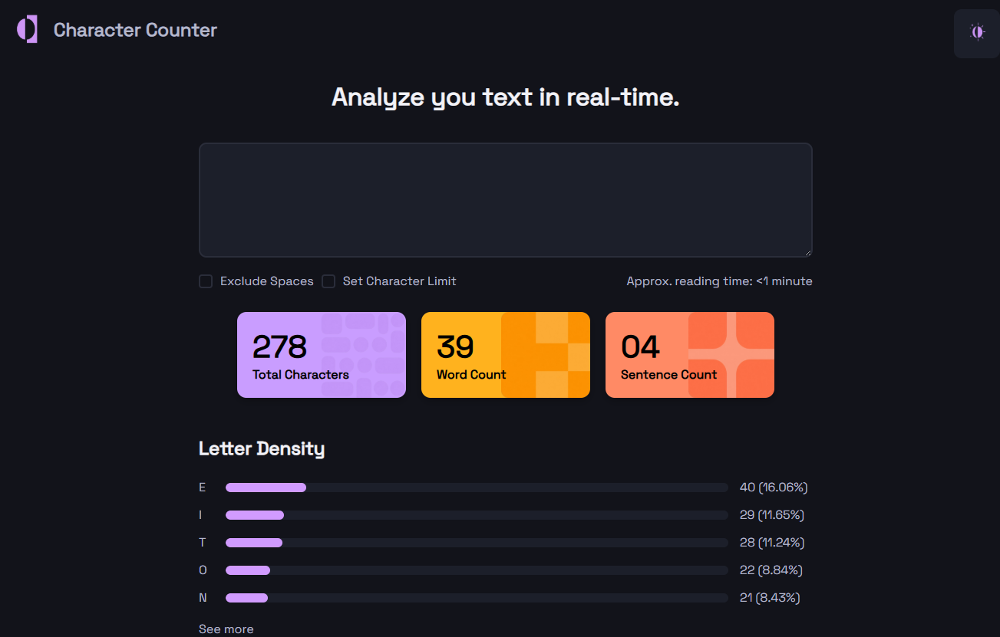

# README - Character Counter

## 1. Objetivo del proyecto.

El objetivo de este proyecto es crear una pagina en el cual se pueda analizar texto en tiempo real junto con ciertas estadisticas como cual es la letra que mas aparece en el texto analizado, el total de caracteres aparecidos en el texto, la cantidad de palabras, y la cantidad de oraciones.

-------------------------------------------------------

## 2. Tecnologías utilizadas. 

* HTML para el armado estructural de la pagina.
* CSS para el estilado y el ordenamiento de la pagina.

-------------------------------------------------------

## 3. Cómo organizaron el HTML.

El HTML se divide en dos partes. La etiqueta **header** y la etiqueta **section** que a su vez contienen varias etiquetas **div** y **span**.

La etiqueta **header** se utilizo para contener el logo de la pagina, el nombre de la pagina, y su boton de cambio de tema.

La etiqueta **section** se utilizo para el armado de la pagina en si. Desde el titulo principal, el textarea, las cards, los checkbox, y la barra de progreso. Mientras que los **divs** se utilizaron para poder trabajar con mas facilidad en ciertos aspectos. (Ej: las barras de progreso y las cards). Los **span** se utilizaron en aspectos muy concretos en el cual no eran necesarios una etiqueta **p** debido al poco contenido que ofrecian

-------------------------------------------------------

## 4. Cómo resolvieron el CSS.

El CSS se resolvio siguiendo los siguientes puntos:

1. Uso de Flexbox para alineación y distribución.
2. Variables CSS en :root para reutilizar colores.
3. Uso de border-radius y box-shadow.
4. Responsive usando clamp().
5. Uso de hover para mejorar interacción.
6. Creación manual de barras de progreso usando divs.

#### 1. Uso de Flexbox para alineación y distribución.

La mayor parte de la pagina se utilizo **display: flex;** para poder trabajar de forma mas flexible con los contenidos que se iban agregando a medida que avanzaba en la realizacion del proyecto. Especialmente con el **body**, el **header**, y la clase **.cards** por decir algunos ejemplos.

#### 2. Variables CSS en :root para reutilizar colores.

No hay mucho que agregar en este punto, se utilizo el :root por si acaso en el futuro los colores del proyecto deciden cambiar

#### 3.Uso de border-radius y box-shadow.

Se utilizo **border-radius** para el boton de cambio de tema, el textarea, las cards, y las barras de progreso. Mientras que el **box-shadow** se utilizo unicamente para darle sombra a las cards

#### 4.Responsive usando clamp().

En este punto fue fundamental gracias a que la funcion **clamp()** me permitio realizar el correcto funcionamiento del responsive ya que sin el, la pagina se podria deformar dependiendo del ancho de pantalla del dispositivo del usuario

#### 5.Uso de hover para mejorar interacción.

Facilita la experiencia del usuario y mostrandole exactamente en que lugares puede apretar y esperar una respuesta/cambio de la pagina. Ya sea en el cambio de tema claro/oscuro (aun no funcional), o en los checkbox

#### 6.Creación manual de barras de progreso usando divs.

Para lograr una representacion fiel a la imagen proporcionada, se utilizo varios divs para poder simular una barra de progreso junto a su progreso para visualizar la idea principal de la pagina

-------------------------------------------------------

## 5. Dificultades encontradas.

Se encontraron varias dificulates aunque principalmente fueron tres que se fueron arreglando a medida que se avanzaba en el codigo: **Problemas con la alineacion**, **Dificultad con la creacion de las barras de progreso** y **La implementacion de imagenes dentro de las cards**

* **Problemas con la alineacion**: Al principio de la creacion de este proyecto se me presentaron problemas debido a que la forma que yo estaba "diseñando" era a traves de la funcion **position** aunque luego me di que no seria optimo dado a que en otros dispositivos podria romperse visualmente el aspecto de la pagina. Se arreglo con el uso del **clamp()** y **margin: auto;**
 

* **Dificultad con la creacion de las barras de progreso**: Este punto fue completamente nuevo para mi y tuve que investigar varias formas de como hacerlo y poder modificarlo ya que con el conocimiento que tenia no era suficiente para dicho desafio. Al final se logro una apariencia parecida y modificable dentro del CSS con respecto al progreso de las barras siendo fiel al procentaje de la imagen
 

* **La implementacion de imagenes dentro de las cards**: Este punto si bien no era nuevo para mi, fue un dolor de cabeza lograr que las imagenes se mostraran correctamente dentro de las cards pero fue solucionado rapidamente con **background-size: contain;**

---------------------------------------------------------------------
## 6. Capturas del resultado final.

